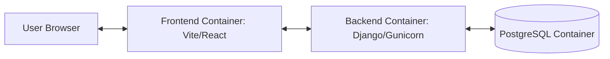

# Zuru - The Ultimate Kenyan Super App


Zuru is a comprehensive multi-service platform designed to streamline daily life in Kenya. From real estate listings to digital services, Zuru brings the power of technology to the streets of Nairobi and beyond.

---

## 🚀 Tech Stack


---

## 🏗️ Architecture Overview

The Zuru project is fully containerized using Docker, ensuring a consistent development and production environment.



- **Frontend**: A high-performance React application built with Vite and styled with Tailwind CSS.
- **Backend**: A robust Django REST Framework API handling business logic, authentication, and database interactions.
- **Database**: A persistent PostgreSQL instance for reliable data storage.

---

## 🛠️ Getting Started

Follow these steps to get your local development environment up and running.

### 1. Clone the repository
```bash
git clone https://github.com/yourusername/zuru.git
cd zuru
```

### 2. Environment Setup
You need to create two `.env` files. You can use the templates below:

#### Backend Settings (`backend/.env`)
Create a file at `backend/.env` and paste:
```env
DJANGO_DEBUG=True
SECRET_KEY=ofgcx2&@8@&7#*3!w!u0io+@3*63dey%2-ws0gt07nvhoen0uw
DJANGO_ALLOWED_HOSTS=localhost,127.0.0.1,web

# Database Settings
POSTGRES_DB=zuru_db
POSTGRES_USER=zuru_admin
POSTGRES_PASSWORD=Angels&demons04
POSTGRES_HOST=db
POSTGRES_PORT=5432

# CORS Settings
CORS_ALLOWED_ORIGINS=http://localhost:5173,http://localhost:3000
```

#### Frontend Settings (`frontend/.env`)
Create a file at `frontend/.env` and paste:
```env
VITE_API_URL=http://localhost:8000
```

### 3. Spin up Containers
Ensure you have Docker and Docker Compose installed, then run:
```bash
docker-compose up --build
```

### 4. Database Migrations & Superuser
Once the containers are running, synchronize the database and create an admin account:
```bash
# Run migrations
docker-compose exec web python manage.py migrate

# Create superuser
docker-compose exec web python manage.py createsuperuser
```

---

## 🌐 Access Points

| Service | URL | Description |
| :--- | :--- | :--- |
| **Frontend** | [http://localhost:5173](http://localhost:5173) | Main user interface |
| **Backend API** | [http://localhost:8000/api](http://localhost:8000/api) | API Documentation & Endpoints |
| **Admin Panel** | [http://localhost:8000/admin](http://localhost:8000/admin) | Django Admin Dashboard |

---

## 📱 Mobile Testing

To test the application on a real mobile device within your local network:
1. Find your local IP address (e.g., `192.168.1.10`).
2. Update `CORS_ALLOWED_ORIGINS` in `backend/.env` to include your mobile's access point.
3. Access the frontend via `http://YOUR_LOCAL_IP:5173`.

---

## 🛡️ Security Note
This project pre-configures `.gitignore` to protect sensitive files like `.env`, `pgdata/`, and `node_modules/`. Never commit your `.env` files to external repositories.
